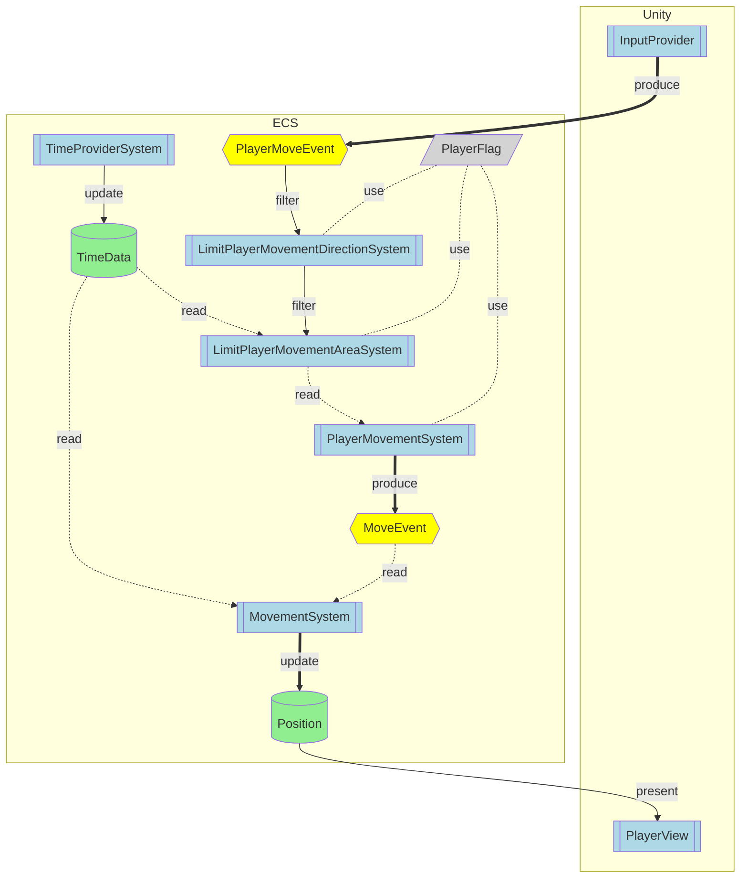

# Data Flow

```mermaid
  %%{init: {'theme':'default'}}%%
  graph TB
    subgraph Unity
    IP[[InputProvider]]
    style IP fill:lightblue
    PV[[PlayerView]]
    style PV fill:lightblue
    end

    subgraph ECS
    T[(TimeData)]
    style T fill:lightgreen
    P[(Position)]
    style P fill:lightgreen
    PF[/PlayerFlag/]
    style PF fill:lightgray
    ME{{MoveEvent}}
    style ME fill:yellow
    PME{{PlayerMoveEvent}}
    style PME fill:yellow

    TPS[[TimeProviderSystem]]
    style TPS fill:lightblue
    LPMDS[[LimitPlayerMovementDirectionSystem]]
    style LPMDS fill:lightblue
    LPMAS[[LimitPlayerMovementAreaSystem]]
    style LPMAS fill:lightblue
    PMS[[PlayerMovementSystem]]
    style PMS fill:lightblue
    MS[[MovementSystem]]
    style MS fill:lightblue
    end

    IP ==> |produce| PME
    P --> |present| PV
    
    TPS --> |update| T

    T -.-> |read| LPMAS
    T -.-> |read| MS

    PME --> |filter| LPMDS --> |filter| LPMAS -.-> |read| PMS ==> |produce| ME -.-> |read| MS

    MS ==> |update| P

    PF -.- |use| LPMDS
    PF -.- |use| LPMAS
    PF -.- |use| PMS
```